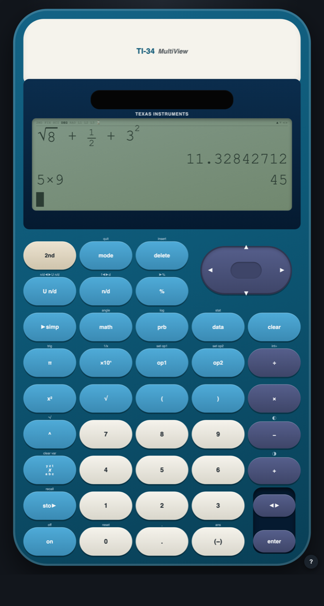

# Virtual TI-34 MultiView

A macOS app, and a web page, that behaves like the **Texas Instruments
TI-34 MultiView** scientific calculator — built for exam practice when you
don't have the physical unit in front of you.

Click the keys, or just type. Every key has a keyboard binding, and pressing a
physical key lights up the corresponding key on the faceplate, so the layout
sinks in while you practise.



## What it does

A full clone, not an approximation:

- 4-line MathPrint display — stacked fractions, real superscripts, radicals
- EOS order of operations, including the two traps: `^` associativity differs
  between Classic and MathPrint, and implicit multiplication binds *loosely*
  (`8 ÷ 2π` is `12.566…`, not `1.27…`)
- exact ↔ decimal toggle, fractions, mixed numbers, manual and auto simplify
- the `2nd` layer, `mode`, `prb`, `math`, `angle`, `data` and `stat` menus
- 1-var and 2-var statistics with the full StatVars list
- memory variables `x y z t a b c`, `ans`, stored operations `op1`/`op2`
- previous-entry recall, and the real calculator's error strings

Behaviour is specified in [`docs/TI-34-SPEC.md`](docs/TI-34-SPEC.md), compiled
from TI's official guidebook. Where this app and that document disagree, the
document is right and the app has a bug.

## Get it

**In a browser** — nothing to install, nothing to allow, works on any machine:

<https://oggefaderen.github.io/ti34-multiview/>

**As a Mac app** — download the `.zip` from
[Releases](https://github.com/oggefaderen/ti34-multiview/releases/latest),
unzip it, and drag `TI-34 MultiView.app` into `/Applications`.

The app isn't signed with an Apple Developer ID, so macOS blocks the first
launch. Open it, let macOS refuse, then go to **System Settings → Privacy &
Security**, scroll to the bottom and click **Open Anyway**. macOS remembers
the decision; every launch after that is an ordinary double-click. The
terminal equivalent is:

```bash
xattr -dr com.apple.quarantine "/Applications/TI-34 MultiView.app"
```

An app you build yourself never picks up that quarantine flag in the first
place, so if you have the Command Line Tools, the build below skips the whole
dance.

## Build and run

Requires macOS with Command Line Tools (`xcode-select --install`). **Xcode is
not needed.**

```bash
./build.sh
open "dist/TI-34 MultiView.app"
```

`build.sh` compiles a small AppKit + WebKit shell with `swiftc` and assembles
the `.app` bundle. There are no third-party dependencies of any kind — no npm
install, no Electron, no package manager.

To drop it in your Applications folder:

```bash
cp -R "dist/TI-34 MultiView.app" /Applications/
```

### Running the UI in a browser

The UI is plain ES modules, and browsers refuse module imports over `file://`
(they are CORS-checked, and a `file://` origin can never satisfy that check).
So serve it rather than double-clicking it:

```bash
python3 -m http.server 8000
open http://localhost:8000/src/ui/index.html
```

The app itself doesn't need this — it serves the bundle over an internal
custom URL scheme for exactly this reason.

## Keyboard map

Press `?` in the app for this table at any time.

| Key | Calculator |
|---|---|
| `0`–`9` `.` | digits and decimal point |
| `+` | + |
| `-` | − |
| `*` | × |
| `/` | ÷ |
| `(` `)` | parentheses |
| `Enter` or `=` | `enter` |
| `Esc` | `clear` |
| `Backspace` | `delete` |
| arrows | the arrow pad |
| `Tab` | `2nd` |
| `\` | `◄►` exact/decimal toggle |
| `s` `c` `t` | sin, cos, tan |
| `S` `C` `T` | sin⁻¹, cos⁻¹, tan⁻¹ |
| `l` / `n` | log / ln |
| `^` | power |
| `r` | √ |
| `q` | x² |
| `p` | π |
| `e` | ×10ⁿ |
| `f` | n/d |
| `F` | U n/d |
| `%` | percent |
| `m` | mode |
| `v` | memory variable |
| `x` | sto► |
| `a` | ans |

## Tests

```bash
node --test 'test/**/*.test.js'
```

The engine is pure — `press(state, key) -> state` and `render(state) -> display`
— so every behaviour in the spec is a test that presses keys and checks the
screen. Tests cite the spec section they come from.

## Project state

[`PROJECT_STATE.md`](PROJECT_STATE.md) tracks what works, what doesn't, and
what to do next. It is written for someone (or some agent) picking the work up
cold.

## Licence

MIT. Not affiliated with or endorsed by Texas Instruments. "TI-34 MultiView" is
a trademark of Texas Instruments; this is an independent reimplementation for
personal study.
